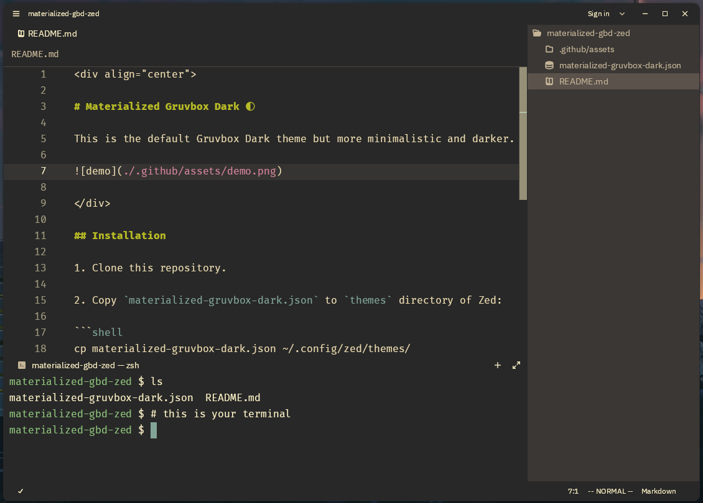

<div align="center">

# Materialized Gruvbox Dark 🌓

This is the default Gruvbox Dark theme but more minimalistic and darker.



</div>

## Installation

1. Clone this repository.

2. Copy `materialized-gruvbox-dark.json` to `themes` directory of Zed:

```shell
cp materialized-gruvbox-dark.json ~/.config/zed/themes/
```

3. Select the `Materialized Gruvbox Dark` theme in the theme selector in Zed.
